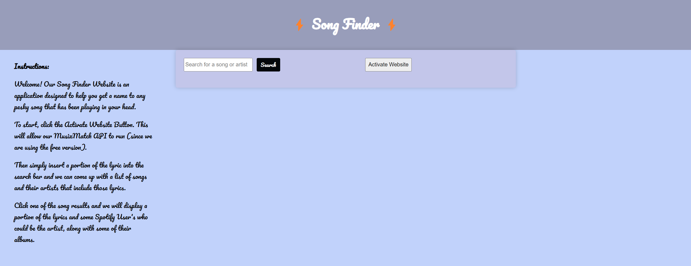
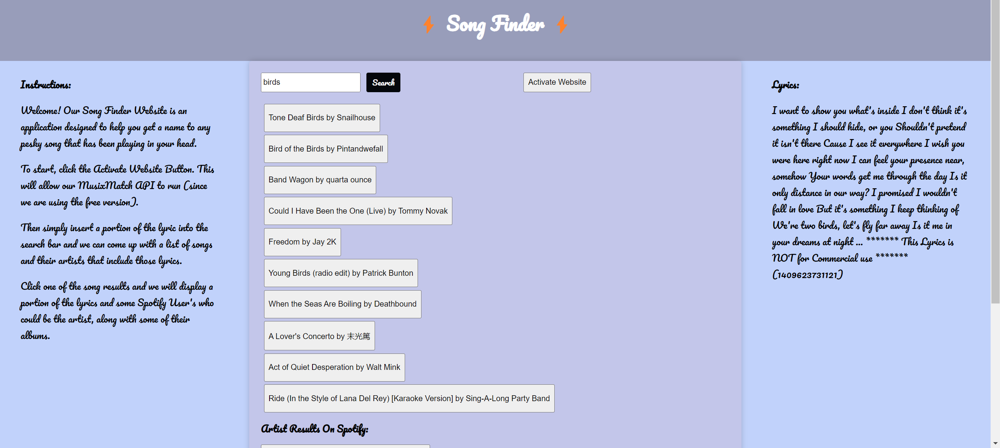
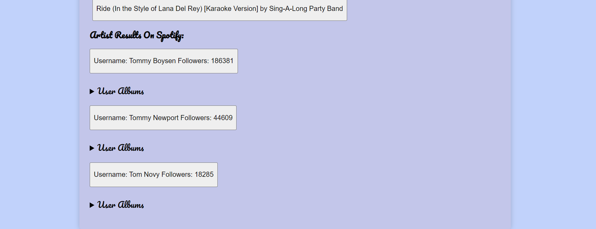
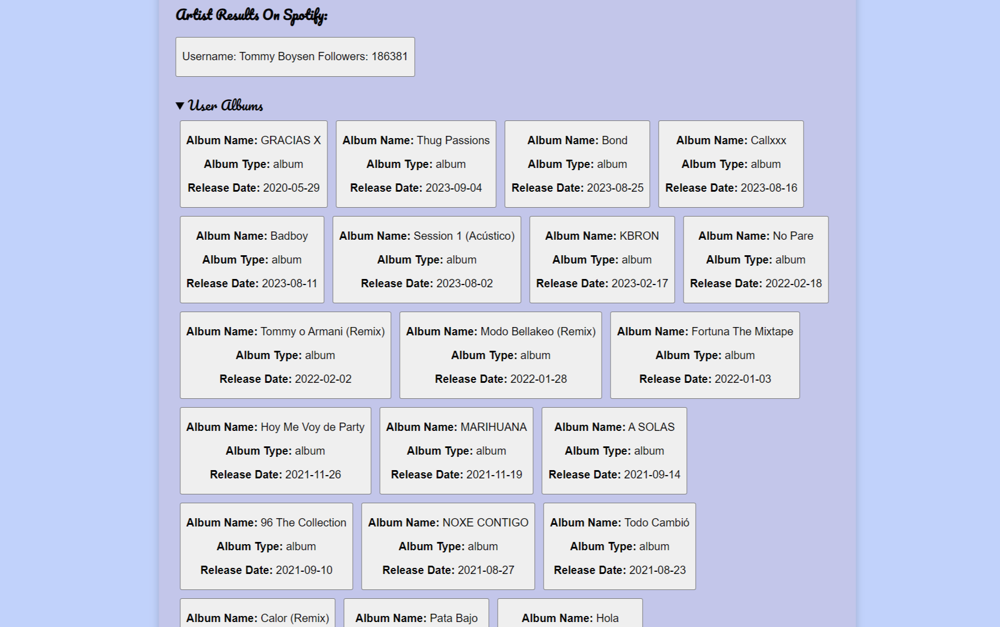

# Song Finder

**Song Finder** _(Deployed Program)_: ![https://smindre1.github.io/Project-One-Front-End-Dev/]

# Description

A simple program that takes the user's input of a song lyric, line or rhyme and discerns which song it is, who the artist is, as well as displaying some of that artist's other songs/albums. Have a tune stuck in your head? Then perhaps you should give this app a try!

## Purpose For Our App

It's an app designed for people who have a lyric or line stuck in their heads but can't figure out where it is from. This app will allow them to find out what the full song is and give them closure on the lyrics they keep looping in their heads, while also suggesting some alternative songs.

## Installation

To Utilize Our Code:

1. First you will need to sign up for an API key on MusixMatch's API site ![https://developer.musixmatch.com/documentation].
2. Once you have your MusixMatch API key you will need to use it to substitute the value of the apiKey variable on line 2 of our script.js file.
3. Please note that we use the free version of MusixMatch's API and if you were to pay for the commercial plan option, you will most likely need to use the Fetch API to make a POST request.
4. For the Spotify API you will need to make an account, and head to ![https://developer.spotify.com/dashboard] where you will make a new app for your account and recieve a Client ID code and a Client Secret code.
5. Insert these codes (Client ID and Client Secret) as replacement values for the my_clientID and clientSecret variables respecitevly, from lines 7 and 8 of our script.js file. Our code will automatically set these variables into a header for a POST request to ![https://accounts.spotify.com/api/token] using the Fetch API and recieve a response containing an access token that can be used to properly fetch from the Spotify API with a GET request.
6. Extra: As a part of the MusixMatch API they ask that when using their API you include a tracker in your code. We used their script_tracking_url in our index.html but they also have a pixel_tracking_url that can be used. To learn more, refer to ![https://developer.musixmatch.com/documentation/api-reference/track-lyrics-get].

## Features

1. On the left of our deployed site/application we present the user with a set of instructions on how to use our application.
2. Next to our search bar we have an 'Activate Website' button that when clicked will lead the user to ![https://cors-anywhere.herokuapp.com]. This will allow the MusixMatch API fetch request to go through a backend server because without a backend server to make the request there will be a CORS policy Error.
3. After the application/site has been activated the user can freely type in a lyric or word into the search bar and the application will return a list of songs, and their artists, that include that lyric.
   
4. These song are clickable buttons and when a user chooses to click one:
   - A portion of that song's lyrics will appear on the right side of the screen (The free version of the MusixMatch API will only give 30-40% of lyrics from a song).
     
   - The artist of the clicked song will be sent through the Spotify API to return three Spotify Username's/artist with similar spelling and the highest follower count to be made into button's that redirect to their spotify pages.
     
   - Underneath each Spotify Artist a list will be made of their albums, each also a clickable link to that album's Spotify page.
     
5. A bonus feature of our application is that clicking another one of the MusixMatch generated songs will cause the displayed lyrics, the Spotify Artists, and their corresponding album lists to be updated.

## Credits

Shane Mindreau, Furkan Coskun, and Joseph Okivie

**APIs Used:**

MusiXMatch: (Gets lyric data based on user search)
![https://developer.musixmatch.com/]
musixmatch api track.search(q lyrics)

Spotify API:
![https://developer.spotify.com/documentation/web-api/reference/search]

**Future Updates**

_We Planned to include the SoundCloud API in future updates as a potential replacement option for the Spotify API. As of this moment however, it is not present in our code._

SoundCloud API: (playlist)
![https://developers.soundcloud.com/docs/api/guide]
